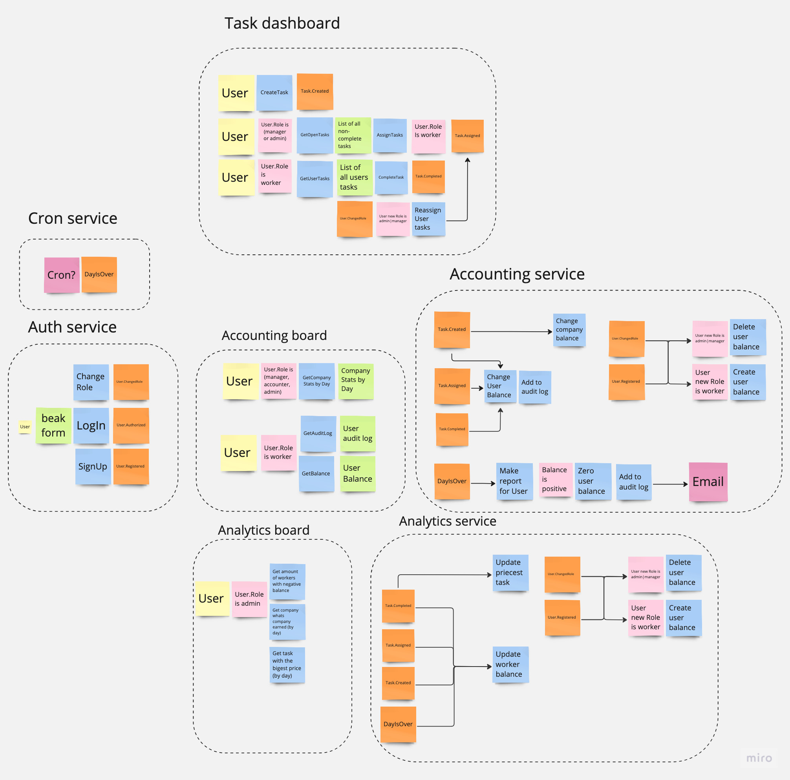
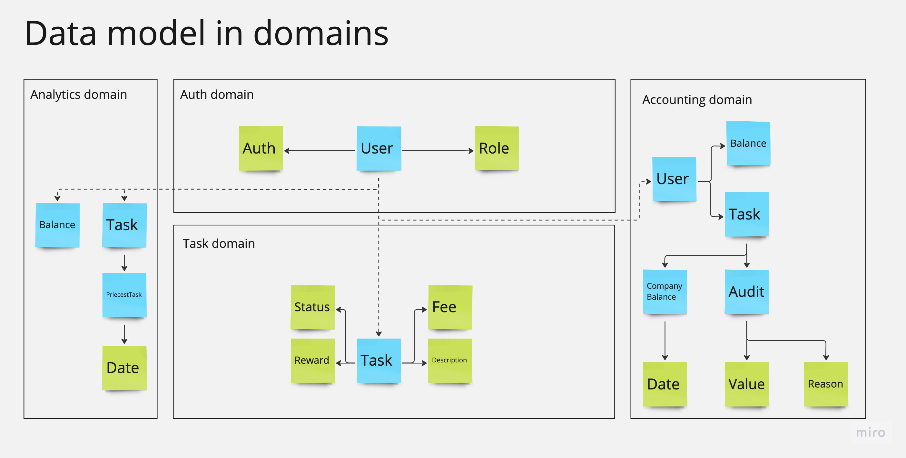
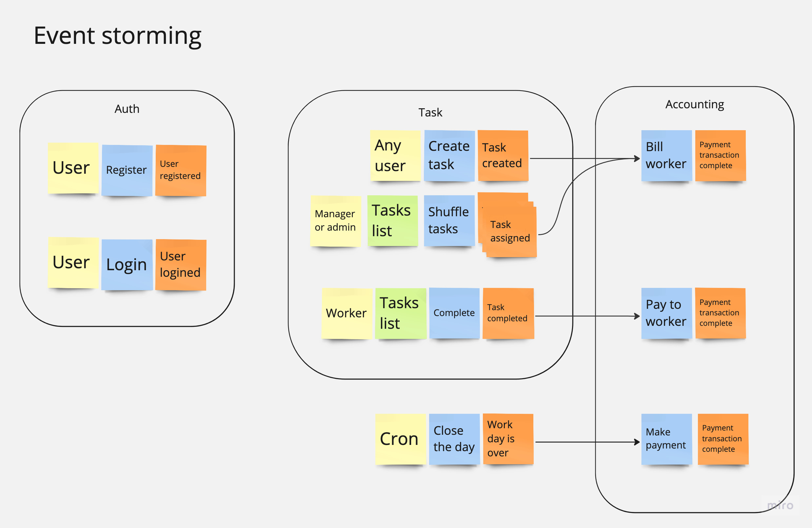
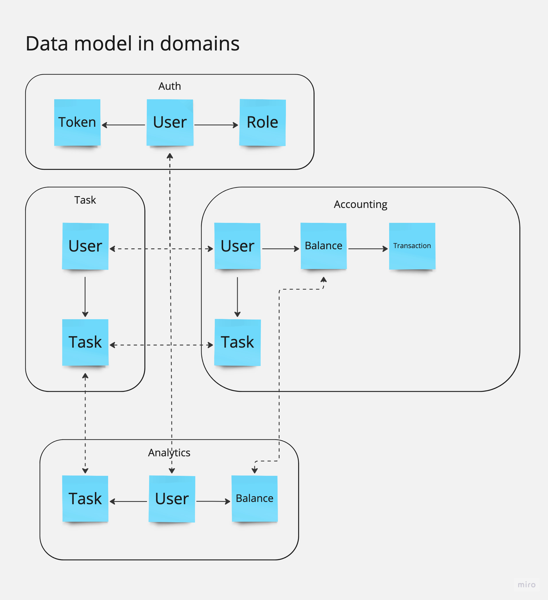
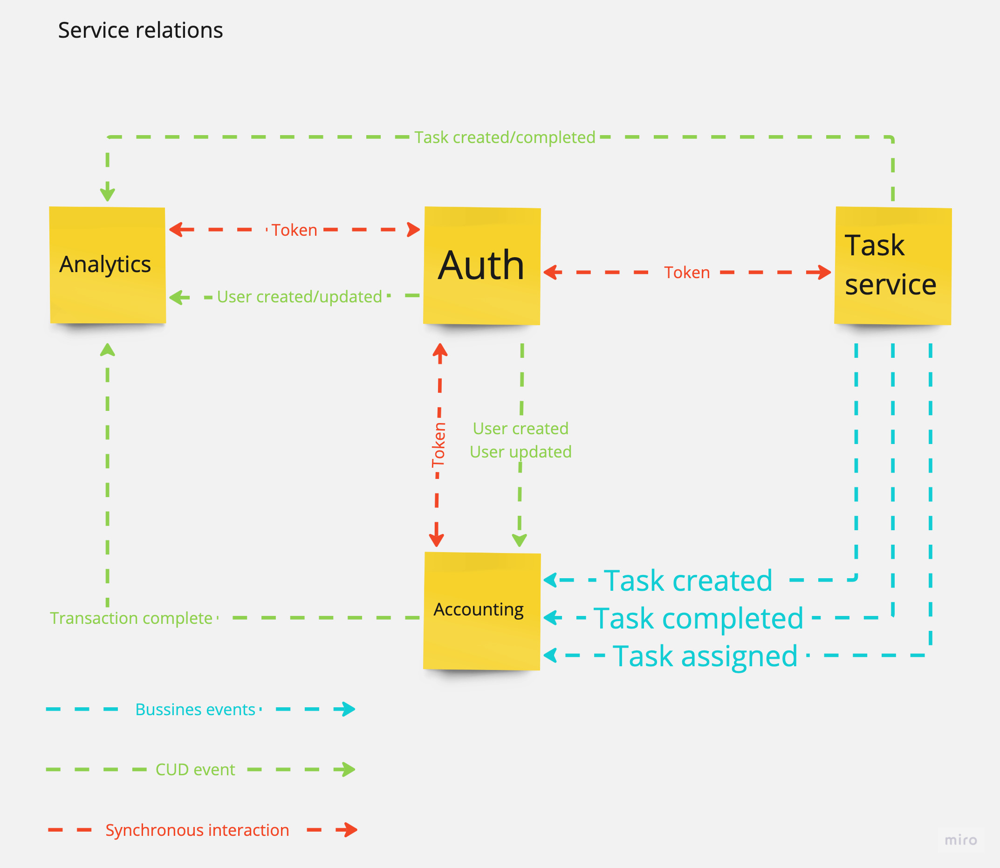

# Architecture

## ES Diagram

### Cron service
Small service to emit `DayIsOver` event at the end of a day.

**Relations**
  - Accounting service (async)
  - Analytics service (async)

**Produce events**
  - DayIsOver

### Auth service
**Relations**
 - Task Dashboard (sync, async)
 - Accounting board (sync)
 - Accounting service (async)
 - Analytics board (sync)
 - Analytics service (async)

**Produce events**
 - User.Authorized
 - User.Registered
 - User.ChangedRole

### Task dashboard
**Relations**
 - Auth service (sync, async)
 - Accounting service (async)
 - Analytics service (async)

**Produce events**
 - Task.Created
 - Task.Assigned
 - Task.Completed

**Consume events**
 - User.ChangedRole

### Accounting board
Shows user/company balance and audit log for every user

**Relations**
 - Auth service (sync)
 - Accounting service (sync)

### Accounting service
Calculate balance for every worker, writes to audit log, makes salary reports

**Relations**
 - Auth service (async)
 - Task dashboard (async)
 - Accounting board (sync)
 - Cron service (async)

**Consume events**
 - User.ChangedRole
 - User.Registered
 - Task.Created
 - Task.Assigned
 - Task.Completed
 - DayIsOver

### Analytics board
Shows analytics

**Relations**
 - Auth service (sync)
 - Analytic service (sync)

### Analytics service
Gather user/task stats.

**Relations**
 - Analytics board (sync)
 - Task dashboard (async)
 - Cron service (async)

**Consume events**
  - User.ChangedRole
  - User.Registered
  - Task.Created
  - Task.Assigned
  - Task.Completed
  - DayIsOver

## Business events
- Task.Created
- Task.Assigned
- Task.Completed
- DayIsOver

## CUD events
- User.Registered (user id, user role)
- User.ChangedRole (user id, user role)

## Data model

# After homework review

Board [link](https://miro.com/app/board/uXjVMxSdsf0=/?share_link_id=711358708796).  
My main mistake was that I didn't understand ES well and use it to describe implementation of my system instead of behaviour.

## ES 

## Data model

## Service relations
