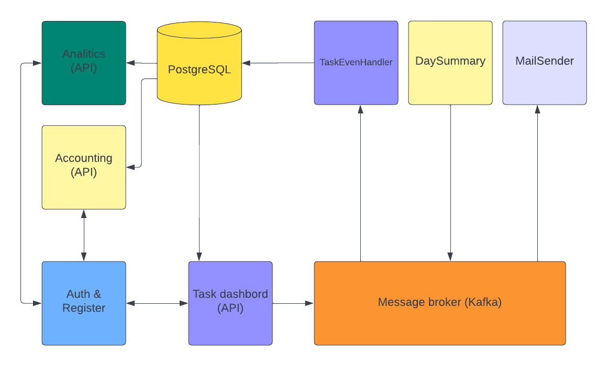
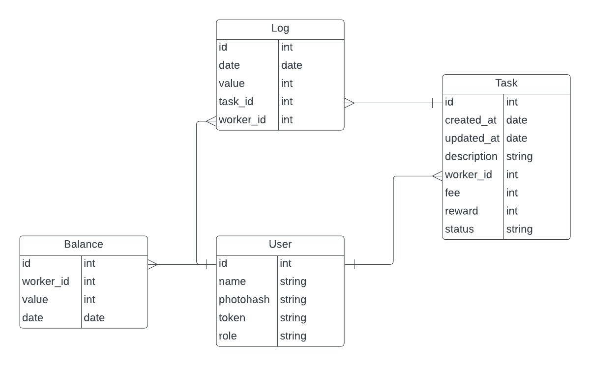

# Architecture

## Diagram


## Services

### Auth API
- Communicate with: PostgresQL (write/read)
- Users: workers, managers, admins, accountants
- Tables: user

Has three methods:
- Login.        Accepts photo hash and returns API Token
- Register.     Accepts user data with photo hash, returns OK if user not exist.
- Authenticate. Accepts token, returns information about user.

### Tasks API
- Communicate with: AuthAPI(check token sync), PostgresQL(read), Message Broker(produce events)
- Users: workers, managers, admins, accountants
- Tables: task, user

Methods:
- POST task create. Create a task. Send an event "task_create"
- PUT task/id/complete. Update task status to "Complete". Send an event "task_complete"
- PUT task/id/assign. Reassign task. Send an event "task_assign".
- PUT tasks/reassign. Reassign every task with "InProgress" state. Send an event "tasks_reassign" (contains ids of tasks).
- GET task/id. Shows information about task.
- GET tasks. Shows information about all user tasks. For managers & admins - shows all tasks.

Task model: 
```json
{
  "id": 1, 
  "author": 3,
  "assigned_to": 2,
  "created_at": "", 
  "updated_at": "",
  "reward": 20,
  "fee": -10,
  "description": "task description",
  "status": "InProgress"
}
```

### Accounting API
- Communicate with: AuthAPI(check token sync), PostgresQL(read)
- Users: worker, admins, accountants, managers
- Tables: log, balance

Methods:
- GET accounting/balance. Shows information
  - for worker: His balance and auditlog. Balance: `sum(completed_tasks.reward) + sum(all_tasks.fee) + balance` 
              `balance` could be zero or negative (previous day wasn't productive)
- GET accounting/stats. For admins, accountants, managers only. Shows how much money company earned:
  `(sum(completed task amount) + sum(assigned task fee) * -1`

Both methods have parameter "date". If it's not present - show information about today.

### Analytics API
- Communicate with: AuthAPI(check token sync), PostgresQL (read)
- Users: admins
- Tables: log, balance

Methods:
- GET analytics/workers. Show how much workers have negative balance today.
- GET analytics/company. How much money company made.
- GET analytics/task. Display task with highest price by date range `from`, `to`

### TaskHandler
- Communicate with: Message Broker(consume), PostgresQL (read & write)
- Tables: task, log

Consumes events:
- task_create. Tries to create task. If success - makes new records in `task` and `log` tables.
- task_complete. Tries to update task to `Complete` status. If success - updates old record in `task` and makes new record in `log` table.
- tasks_reassign. Update worker for every task. Updates records in `task` tables.

### DailyAccounting
- Communicate with: Message Broker(produce), PostgresQL (read & write)
- Tables: log, balance

Cronjob. Runs every day to calculate balance for every user. Writes results to `balance` table.

Produce events:
- send_email. Email to a user with his daily balance.

### MailSender
- Communicate with: Message Broker(consume)

Consume events:
- send_email

## Database

User - stores information about users. Used in authentication service.<br/>
Task - stores information about tasks. Used in TasksAPI, TaskHandler services.<br/>
Log - stores logs about workers activity (fees & rewards for tasks). Used in TaskHandlers, AccountingAPI, AnalyticsAPI & DailyAccounting services.<br/>
Balance - stores days snapshot of workers activity. Used in AccountingAPI, AnalyticsAPI & DailyAccounting services.<br/>

## Possible issues
- Message broker isn't responding. Try to reconnect.
- Database isn't responding. Try a few times then return task back to queue.
- TaskHandler dies during event processing. Use transaction for PostgresQL and timeout for event processing.
- Race condition. If someone complete task when we are reasigning this task - who will get the money? Use transaction and if statement in SQL Update.

